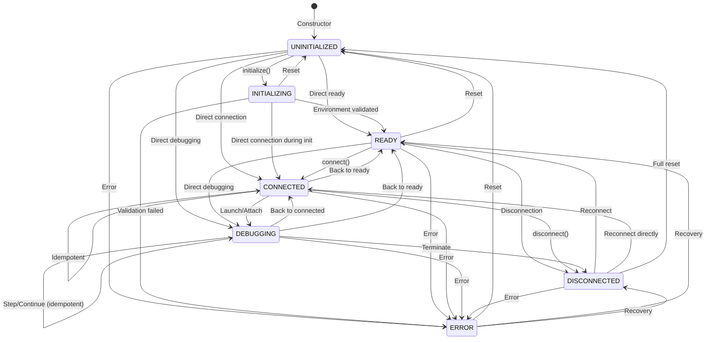

# Mock Debug Adapter Design

## Purpose

The Mock Debug Adapter enables comprehensive testing of the mcp-debugger system without requiring external debuggers or language runtimes. It simulates realistic debugging scenarios while providing deterministic, controllable behavior for testing.

### Key Benefits

1. **Test Isolation**: No external dependencies required
2. **Deterministic Behavior**: Predictable outcomes for reliable tests
3. **Error Simulation**: Test error handling and edge cases
4. **Performance Testing**: Measure adapter overhead without runtime variability
5. **Development Speed**: Test new features before implementing real adapters

## State Machine

The mock adapter follows a permissive state machine that mirrors real adapter behavior. Real adapters (e.g., Python/debugpy) do not enforce strict sequential transitions, so the mock intentionally allows shortcut paths:



## Simulated Behaviors

### 1. Breakpoint Hits

Breakpoint management happens inside the mock adapter process (`MockDebugAdapterProcess`). It stores breakpoints per-file via `setBreakpoints` requests and tracks a `currentLine` counter:

- On **launch**: If `stopOnEntry` is true, emits `stopped(entry)` after 100ms. Otherwise, sorts all breakpoints by line, jumps to the first one and emits `stopped(breakpoint)` after 200ms. If no breakpoints are set, emits `terminated` + `exited`.
- On **continue**: Finds the next breakpoint after `currentLine`, jumps to it and emits `stopped(breakpoint)` after a 200ms delay. If no breakpoint remains, emits `terminated` + `exited` after a 200ms delay.

All breakpoints are returned as `verified: true` with a random numeric ID. The `MockDebugAdapter` class (used by the adapter registry) handles DAP events via `handleDapEvent()`, updating `currentThreadId` on `stopped` events and transitioning to the `DEBUGGING` state.

### 2. Variable Inspection

The mock adapter process returns hardcoded scopes and variables. The `scopes` response returns two scopes (Locals and Globals), each backed by a dynamically-allocated variable reference:

```typescript
// Locals scope variables
{ name: 'x', value: '10', type: 'int' }
{ name: 'y', value: '20', type: 'int' }
{ name: 'result', value: '30', type: 'int' }

// Globals scope variables
{ name: '__name__', value: '"__main__"', type: 'str' }
{ name: '__file__', value: '"simple-mock.js"', type: 'str' }
```

All variables have `variablesReference: 0` (not expandable). Variable references are managed by an incrementing counter starting at 1000.

### 3. Step Operations

Step operations are handled by the mock adapter process with minimal simulation:

- **next** (step over): Increments `currentLine` by 1, sends success response, then emits `stopped(step)` after 50ms.
- **stepIn**: Increments `currentLine` by 1, sends success response, then emits `stopped(step)` after 50ms.
- **stepOut**: Increments `currentLine` by 1, sends success response, then emits `stopped(step)` after 50ms.
- **pause**: Immediately sends `stopped(pause)` with no delay.

All step events use `threadId: 1` and `allThreadsStopped: true`.

### 4. Error Scenarios

The mock adapter supports two error scenarios via `MockErrorScenario`:

```typescript
enum MockErrorScenario {
  NONE = 'none',
  EXECUTABLE_NOT_FOUND = 'executable_not_found',
  CONNECTION_TIMEOUT = 'connection_timeout'
}
```

Error scenarios are controlled at runtime via `setErrorScenario()` on the `MockDebugAdapter` instance (which accepts a single `MockErrorScenario` value). `MockAdapterConfig` does not have an `errorScenarios` field; error scenarios are set exclusively via the runtime method:

- **EXECUTABLE_NOT_FOUND**: Causes `validateEnvironment()` to return `{ valid: false }` with a `MOCK_NOT_FOUND` error code. The `initialize()` method checks this result and throws an `AdapterError` with `EXECUTABLE_NOT_FOUND` (not `ENVIRONMENT_INVALID`), transitioning the adapter to the `ERROR` state.
- **CONNECTION_TIMEOUT**: Causes `connect()` to throw an `AdapterError` with `CONNECTION_TIMEOUT` (recoverable).

```typescript
const adapter = new MockDebugAdapter(dependencies);
adapter.setErrorScenario(MockErrorScenario.CONNECTION_TIMEOUT);
// connect() will now throw AdapterError with CONNECTION_TIMEOUT
```

## Test Scenarios

### Scenario 1: Basic Debugging Flow
```typescript
// Note: Without stopOnEntry: true, launch runs to the first breakpoint directly.
// There is no 'entry' stop — the first stop is at the breakpoint.
const scenario: MockScenario = {
  name: 'basic-debugging',
  steps: [
    { action: 'setBreakpoint', args: { file: 'main.mock', line: 5 } },
    { action: 'launch', args: { script: 'main.mock' } },
    { action: 'waitForStop', expected: { reason: 'breakpoint', line: 5 } },
    { action: 'stepOver' },
    { action: 'waitForStop', expected: { reason: 'step', line: 6 } },
    { action: 'continue' },
    { action: 'waitForTerminate' }
  ]
};
```

### Scenario 2: Variable Inspection
```typescript
const scenario: MockScenario = {
  name: 'variable-inspection',
  steps: [
    { action: 'launch', args: { script: 'variables.mock', stopOnEntry: true } },
    { action: 'waitForStop' },
    { action: 'getStackTrace', expected: { frameCount: 2 } },
    { action: 'getScopes', args: { frameId: 0 } },
    { action: 'getVariables', args: { variablesReference: 1000 } }
  ]
};
```

### Scenario 3: Error Handling
```typescript
const scenario: MockScenario = {
  name: 'error-handling',
  steps: [
    { action: 'setErrorScenario', args: { scenario: 'connection_timeout' } },
    { action: 'launch', args: { script: 'main.mock' } },
    { action: 'expectError', expected: { code: 'CONNECTION_TIMEOUT' } },
    { action: 'clearErrorScenario' },
    { action: 'launch', args: { script: 'main.mock' } },
    { action: 'waitForStop' }
  ]
};
```

### Scenario 4: Performance Testing
```typescript
const scenario: MockScenario = {
  name: 'performance-test',
  steps: [
    { action: 'setBreakpoints', args: { count: 100 } },
    { action: 'launch', args: { script: 'perf.mock' } },
    { action: 'measureTime', label: 'startup' },
    { action: 'stepOver', repeat: 1000 },
    { action: 'measureTime', label: 'thousand-steps' },
    { action: 'getVariables', args: { largeObject: true } },
    { action: 'measureTime', label: 'large-variables' }
  ]
};
```

## Configuration

The mock adapter accepts a `MockAdapterConfig` object at construction:

```typescript
interface MockAdapterConfig {
  // Timing configuration
  connectionDelay?: number;     // Delay for connect operation (default: 50ms)

  // Behavior configuration
  supportedFeatures?: DebugFeature[];  // Which DAP features to support
}
```

Note: Error scenarios are not part of `MockAdapterConfig`. They are controlled at runtime via `adapter.setErrorScenario(MockErrorScenario.CONNECTION_TIMEOUT)` on the `MockDebugAdapter` instance.

Default supported features are determined by the constructor-normalized config (defaults: `CONDITIONAL_BREAKPOINTS`, `FUNCTION_BREAKPOINTS`, `VARIABLE_PAGING`, `SET_VARIABLE`). The `getCapabilities()` method builds a DAP capability object with hardcoded true values and dynamic flags keyed off `supportsFeature` for function breakpoints, conditional breakpoints, hover evaluation, set-variable, and log points. Refer to the mock adapter source for the exact default set.

Usage:

```typescript
const factory = new MockAdapterFactory({
  connectionDelay: 100,
  supportedFeatures: [
    DebugFeature.CONDITIONAL_BREAKPOINTS,
    DebugFeature.FUNCTION_BREAKPOINTS
  ]
});

const adapter = factory.createAdapter(dependencies);
// Error scenarios are set on the adapter instance at runtime:
adapter.setErrorScenario(MockErrorScenario.CONNECTION_TIMEOUT);
```

## Mock Adapter Process

The mock adapter includes a separate process (`mock-adapter-process.ts`) that simulates a real DAP server. While the process supports both stdio and TCP transport, the `MockDebugAdapter.buildAdapterCommand()` always launches it in TCP mode (passing `--port` and `--host` arguments). Stdio mode is available for standalone testing but is not used by the adapter in normal operation:

```
Usage: node mock-adapter-process.js [--port=<port>] [--host=<host>] [--session=<id>]
```

The process implements a `DAPConnection` class that handles Content-Length framed DAP messages over streams. In TCP mode, it creates a `net.Server` and allows client reconnection.

**Supported DAP commands**: `initialize`, `configurationDone`, `launch`, `setBreakpoints`, `threads`, `stackTrace`, `scopes`, `variables`, `evaluate`, `continue`, `next`, `stepIn`, `stepOut`, `pause`, `disconnect`, `terminate`.

**Simulated behavior**:
- **Breakpoints**: Tracked per-file. On `launch`, if `stopOnEntry` is true, sends a `stopped(entry)` event. Otherwise runs to the first breakpoint (sorted by line) or terminates if none are set.
- **Continue**: Finds the next breakpoint after the current line and stops there, or sends `terminated` + `exited` if no more breakpoints remain.
- **Step operations**: `next`, `stepIn`, and `stepOut` all increment `currentLine` by one and send `stopped(step)` events after a 50ms delay.
- **Variables**: Returns hardcoded scopes (Locals with `x=10, y=20, result=30`; Globals with `__name__, __file__`).
- **Evaluate**: Always returns `'mock_value'` of type `string`.
- **Stack trace**: Returns two frames: `main` (at current line) and `mockFunction` (at line 42).

## Testing with Mock Adapter

### Unit Test Example
```typescript
describe('MockDebugAdapter', () => {
  let adapter: MockDebugAdapter;

  beforeEach(() => {
    adapter = new MockDebugAdapter(mockDependencies, {
      connectionDelay: 0  // No delays in tests
    });
  });

  it('should initialize successfully', async () => {
    await adapter.initialize();
    expect(adapter.getState()).toBe(AdapterState.READY);
    expect(adapter.isReady()).toBe(true);
  });

  it('should simulate error scenario', async () => {
    adapter.setErrorScenario(MockErrorScenario.EXECUTABLE_NOT_FOUND);
    await expect(adapter.initialize()).rejects.toThrow(AdapterError);
    expect(adapter.getState()).toBe(AdapterState.ERROR);
  });
});
```

### Integration Test Example
```typescript
describe('SessionManager with MockAdapter', () => {
  it('should handle full debugging session', async () => {
    const registry = new AdapterRegistry();
    registry.register('mock', new MockAdapterFactory());
    
    const sessionManager = new SessionManager({ adapterRegistry: registry });
    const session = await sessionManager.createSession({
      language: 'mock',
      name: 'Test Session'
    });
    
    const result = await sessionManager.startDebugging(
      session.id,
      'test.mock',
      [],
      { stopOnEntry: true }
    );
    
    expect(result.success).toBe(true);
    expect(session.state).toBe(SessionState.PAUSED);
  });
});
```

## Performance Characteristics

The mock adapter provides consistent performance for benchmarking:

| Operation | Mock Time | Real Python Time | Notes |
|-----------|-----------|------------------|-------|
| Initialize | 10ms | 80-120ms | Mock is predictable |
| Set Breakpoint | 1ms | 5-10ms | No file I/O |
| Step Operation | 5ms | 20-50ms | Configurable delay |
| Get Variables | 2ms | 10-100ms | Depends on object size |
| Launch | 50ms | 200-500ms | No process spawn |

## Future Enhancements

1. **Scenario Recording**: Record real debugging sessions and replay with mock
2. **Chaos Testing**: Introduce random failures and timing variations
3. **Protocol Fuzzing**: Test protocol handling with malformed messages
4. **Load Testing**: Simulate hundreds of concurrent sessions
5. **Visual Debugger**: Web UI to visualize mock adapter state

## Conclusion

The Mock Debug Adapter is a crucial component for:
- Rapid development and testing
- Ensuring consistent test results
- Testing error conditions safely
- Performance benchmarking
- Developer onboarding

It provides a complete simulation of debugging behavior without external dependencies, making the test suite fast, reliable, and comprehensive.
