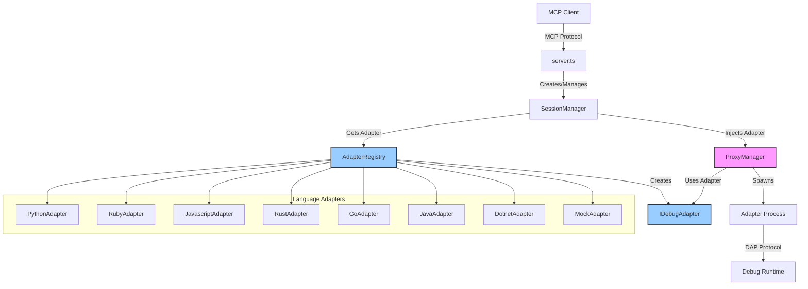
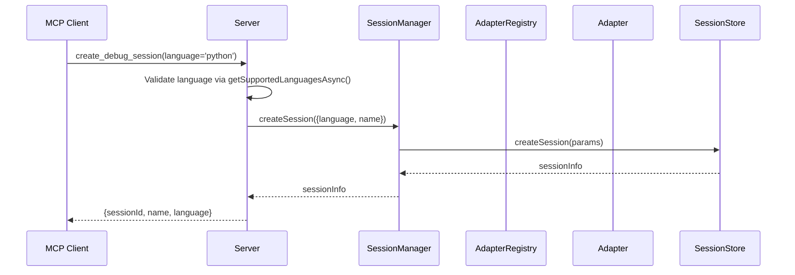
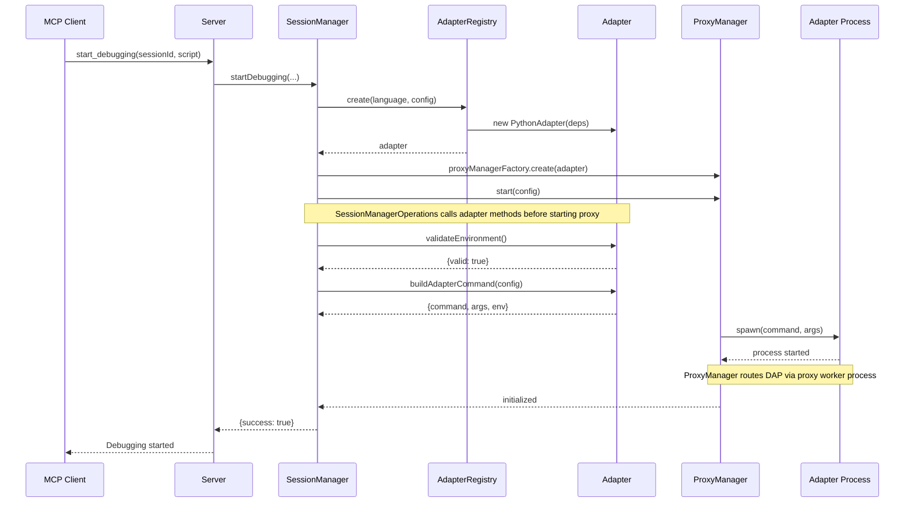
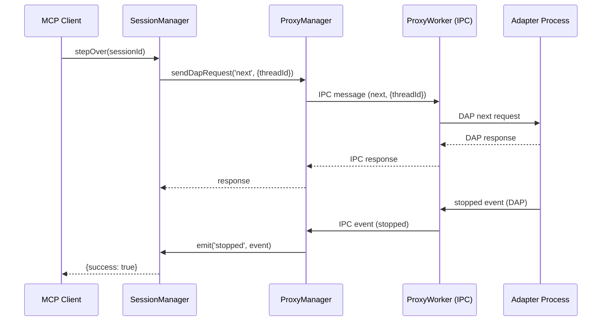

# Debug Adapter Pattern Design

## Overview

The Debug Adapter Pattern powers mcp-debugger as a multi-language debugging platform supporting 7 programming languages plus a mock adapter (Python, Ruby, JavaScript, Rust, Go, Java, and .NET/C#). This design uses a **dual-pattern architecture** that combines two complementary adapter patterns:

1. **IDebugAdapter Interface**: Complete adapter implementations for full language support
2. **AdapterPolicy Interface**: Lightweight policies for language-specific session management behaviors

### Design Philosophy

1. **Wrap, Don't Rewrite**: The existing ProxyManager provides excellent process management. We inject adapters to handle language-specific concerns.
2. **Interface Segregation**: Keep interfaces focused and cohesive
3. **Dependency Inversion**: Core depends on interfaces, not implementations
4. **Open/Closed**: Open for extension (new languages), closed for modification
5. **Single Responsibility**: Each adapter handles one language

## Dual-Pattern Architecture: IDebugAdapter and AdapterPolicy

### The Two Patterns Work Together

The mcp-debugger architecture uses both patterns in complementary roles:

#### IDebugAdapter (Complete Adapter)
- **Scope**: Full language support implementation
- **Lifecycle**: Created per debugging session
- **Responsibility**: DAP protocol, process management, environment setup
- **Location**: `packages/adapter-<language>/`
- **State**: Instance-based, stateful

#### AdapterPolicy (Lightweight Policy)
- **Scope**: Language-specific behaviors for session management
- **Lifecycle**: Static/singleton pattern
- **Responsibility**: Validation, filtering, extraction policies
- **Location**: Policy implementations are in `packages/shared/src/interfaces/adapter-policy-*.ts`. Policy selection logic lives in three places: `session-manager-data.ts` (via `selectPolicy()`) for session-level data operations, `dap-proxy-worker.ts` (via `selectAdapterPolicy()`) for proxy-level adapter behavior, and `session-store.ts` for session persistence policy selection.
- **State**: Stateless policy object

### Pattern Interaction

```typescript
// During session creation
const adapter = await adapterRegistry.create(session.language, config); // IDebugAdapter
const policy = this.selectPolicy(session.language);                     // AdapterPolicy

// IDebugAdapter handles core debugging
await adapter.validateEnvironment();
const command = adapter.buildAdapterCommand(config);

// AdapterPolicy handles session behaviors
if (policy.validateExecutable) {
  await policy.validateExecutable(executablePath);
}
if (policy.performHandshake) {
  // performHandshake runs AFTER the proxy process has started and DAP initialization
  // is complete. It handles adapter-specific post-init coordination (e.g., js-debug
  // child session negotiation).
  await policy.performHandshake(context);
}
```

### Why Two Patterns?

1. **Historical Evolution**: The codebase originally had language-specific conditionals scattered throughout. The refactoring introduced AdapterPolicy to centralize these behaviors without requiring full adapter rewrites.

2. **Separation of Concerns**: 
   - IDebugAdapter = "How to debug this language"
   - AdapterPolicy = "How to manage sessions for this language"

3. **Flexibility**: Policies can be modified without touching adapter implementations

4. **Testing**: Policies are simple objects that are easier to test than full adapter implementations

For more details on AdapterPolicy, see [Adapter Policy Pattern Documentation](./adapter-policy-pattern.md).

## Architecture Diagram



## Interface Design Decisions

### Why These Methods?

#### Lifecycle Management
- **`initialize()`**: Performs one-time adapter setup (resource preparation, internal state initialization)
- **`validateEnvironment()`**: Separate method for environment validation (checking prerequisites, dependencies)
- **`dispose()`**: Ensures clean resource cleanup

**Rationale**: Separates construction from initialization, and separates lifecycle setup from environment validation, allowing dependency injection while deferring expensive operations.

#### State Management
- **`getState()`**: Provides current adapter state
- **`isReady()`**: Quick check for debugging readiness
- **`getCurrentThreadId()`**: Tracks active debugging thread

**Rationale**: Enables state monitoring without tight coupling to internal implementation.

#### Environment Validation
- **`validateEnvironment()`**: Comprehensive environment check
- **`getRequiredDependencies()`**: Lists what's needed

**Rationale**: Fail-fast principle - detect problems early with clear error messages.

#### Executable Management
- **`resolveExecutablePath()`**: Finds the language runtime
- **`getDefaultExecutableName()`**: Platform-aware defaults
- **`getExecutableSearchPaths()`**: Where to look for executables

**Rationale**: Abstracts platform differences and user configurations.

#### DAP Protocol Operations
- **`sendDapRequest()`**: Sends requests to debug adapter
- **`handleDapEvent()`**: Processes incoming events
- **`handleDapResponse()`**: Handles request responses

**Rationale**: While ProxyManager handles the transport, adapters may need to transform or enhance DAP messages for language-specific behavior.

### Event Model

Adapters emit events for state changes and DAP protocol events:

```typescript
adapter.on('stateChanged', (oldState, newState) => {
  logger.info(`Adapter state: ${oldState} → ${newState}`);
});

adapter.on('stopped', (event) => {
  logger.info(`Debugger stopped: ${event.body.reason}`);
});
```

### Error Handling

Consistent error patterns across adapters:

```typescript
try {
  await adapter.validateEnvironment();
} catch (error) {
  if (error instanceof AdapterError) {
    if (error.code === AdapterErrorCode.EXECUTABLE_NOT_FOUND) {
      // Show installation instructions
      console.log(adapter.getInstallationInstructions());
    }
    if (error.recoverable) {
      // Attempt recovery
    }
  }
}
```

## Sequence Diagrams

### Session Creation with Adapter



### Debugging Lifecycle



### Step Operation with Adapter



## Migration Strategy

### Phase 1: Interface Creation
1. Create IDebugAdapter interface ✅
2. Create IAdapterRegistry interface
3. Create mock adapter for testing
4. ✅ Update types to use `executablePath` instead of `pythonPath` (COMPLETED)

### Phase 2: Mock Implementation
1. Implement MockDebugAdapter
2. Create mock adapter process script
3. Add mock adapter tests
4. Verify interface completeness

### Phase 3: Python Adapter
1. Create PythonDebugAdapter class
2. Move logic from python-utils.ts
3. Extract Python-specific code from SessionManager
4. Update ProxyManager to accept adapters

### Phase 4: Integration (COMPLETED)
1. SessionManager always uses AdapterRegistry for adapter creation. Dynamic loading only changes how missing factories are resolved: when `enableDynamicLoading` is enabled (or in container mode), the registry delegates to `AdapterLoader` to import the package on demand; otherwise, only pre-registered factories are available.
2. server.ts validates language support via `getSupportedLanguagesAsync()`, which queries the AdapterRegistry. A hardcoded fallback to `[PYTHON, MOCK]` exists when dynamic discovery is unavailable.
3. Language adapters load via `@debugmcp/adapter-<language>` packages (dynamically when enabled, or pre-registered)
4. Tests updated across the board

## Component Responsibilities

### ProxyManager (What it Keeps)
- Process lifecycle management
- IPC communication with proxy process
- Request/response correlation
- Event forwarding
- DAP message transport

### IDebugAdapter (What it Owns)
- Language-specific configuration
- Executable discovery and validation
- Command building for debug adapter
- Error message translation
- Feature capability declaration
- Language-specific path handling
- DAP message transformation (if needed)

### AdapterRegistry
- Adapter registration and discovery
- Language support checking
- Adapter instance creation
- Dependency injection into adapters

### SessionManager (Modified Role)
- Session lifecycle orchestration
- Adapter selection based on language
- ProxyManager creation with adapter
- High-level debugging operations

## Performance Considerations

### Overhead Analysis

| Operation | Current | With Adapters | Impact |
|-----------|---------|---------------|--------|
| Session Creation | 100ms | 105ms | +5% (adapter creation) |
| Language Detection | 80ms | 80ms | No change (moves to adapter) |
| Breakpoint Setting | <10ms | <10ms | No change |
| Step Operations | <50ms | <50ms | No change |
| Memory per Session | Baseline | +~1MB | Adapter instance |

### Optimization Strategies

1. **Lazy Adapter Loading**
   ```typescript
   // Only load adapter when first used
   const adapter = await registry.create(language, config);
   ```

2. **Per-Session Adapters with Auto-Dispose**
   Adapters are created per session and automatically disposed when the session ends or the adapter enters a disconnected/error state. The `AdapterRegistry` subscribes to adapter `stateChanged` events and starts a dispose timer when the adapter becomes disconnected or errored.

3. **Parallel Initialization**
   ```typescript
   // Initialize adapter while creating session
   const [session, adapter] = await Promise.all([
     sessionStore.create(params),
     registry.create(language, config)
   ]);
   ```

## MCP Tool Changes

### Current Tool Signature
```json
{
  "name": "create_debug_session",
  "inputSchema": {
    "properties": {
      "language": { "enum": ["python", "javascript", "rust", "go", "java", "dotnet", "mock"] },
      "executablePath": { "type": "string" }
    }
  }
}
```

**Note**: The `language` enum in the tool schema is dynamically generated from the languages discovered by the AdapterRegistry (via `getSupportedLanguagesAsync()`). The list above represents the current defaults but may vary based on which adapter packages are installed.

**Note**: The `pythonPath` parameter has been deprecated. Callers should use `executablePath`. Some internal compatibility/migration support for legacy Python-oriented configs still exists via `ConfigMigration` in the shared contracts.

### Session Creation Flow

1. **Client Request**
   ```json
   {
     "tool": "create_debug_session",
     "arguments": {
       "language": "python",
       "executablePath": "/usr/bin/python3"
     }
   }
   ```

2. **Server Processing**
   - Check if language is supported via AdapterRegistry
   - Create session with language stored
   - Return session info

3. **Debugging Start**
   - SessionManager creates appropriate adapter
   - Adapter validates environment
   - ProxyManager uses adapter for configuration

## Error Handling Patterns

### Adapter Not Found
```typescript
class AdapterNotFoundError extends AdapterError {
  constructor(language: string) {
    super(
      `No debug adapter registered for language: ${language}`,
      AdapterErrorCode.ADAPTER_NOT_FOUND,
      false
    );
  }
}
```

### Environment Invalid
```typescript
class EnvironmentInvalidError extends AdapterError {
  constructor(message: string, instructions: string) {
    super(message, AdapterErrorCode.ENVIRONMENT_INVALID, true);
    this.instructions = instructions;
  }
}
```

### Graceful Degradation
```typescript
// If feature not supported, disable UI elements
if (!adapter.supportsFeature(DebugFeature.CONDITIONAL_BREAKPOINTS)) {
  disableConditionalBreakpoints();
}
```

## Testing Strategy

### Unit Tests
- Test each adapter method in isolation
- Mock external dependencies
- Verify error handling

### Integration Tests
- Test adapter with real ProxyManager
- Verify DAP communication
- Test language-specific features

### E2E Tests
- Full debugging session per language
- Cross-language compatibility
- Performance benchmarks

## Future Extensibility

### Adding a New Language

1. **Create Adapter Class**
   ```typescript
   export class GoDebugAdapter extends EventEmitter implements IDebugAdapter {
     readonly language = DebugLanguage.GO;
     readonly name = "Go Debug Adapter";
     // ... implement interface
   }
   ```

2. **Register with Registry**
   ```typescript
   registry.register('go', new GoAdapterFactory());
   ```

3. **Update Enum**
   ```typescript
   export enum DebugLanguage {
     PYTHON = 'python',
     JAVASCRIPT = 'javascript',
     RUST = 'rust',
     GO = 'go',
     JAVA = 'java',
     DOTNET = 'dotnet',
     MOCK = 'mock'
   }
   ```

4. **Add Tests**
   - Unit tests for adapter
   - Integration tests
   - Update E2E test matrix

### Feature Flags
```typescript
// Enable experimental languages
const EXPERIMENTAL_LANGUAGES = process.env.EXPERIMENTAL_LANGUAGES?.split(',') || [];
if (EXPERIMENTAL_LANGUAGES.includes('rust')) {
  registry.register('rust', new RustAdapterFactory());
}
```

## Success Metrics

### Functional Metrics
- ✅ All existing Python tests pass
- ✅ No breaking changes to MCP API
- ✅ Can add new language without changing core
- ✅ Mock adapter enables testing without external dependencies

### Performance Metrics
- ✅ Session creation < 150ms
- ✅ Adapter overhead < 5ms per operation
- ✅ No memory leaks with multiple adapters
- ✅ DAP operations performance unchanged

### Code Quality Metrics
- ✅ Reduced coupling (Python deps in adapter only)
- ✅ Increased testability (mockable adapters)
- ✅ Clear separation of concerns
- ✅ Type safety throughout

## Conclusion

This adapter pattern design provides a clean, extensible architecture for multi-language debugging support. Key benefits:

1. **Minimal Risk**: Existing ProxyManager continues to work as-is
2. **Incremental Migration**: Each phase provides value
3. **Future-Proof**: Easy to add new languages
4. **Testable**: Mock adapter enables comprehensive testing
5. **Performant**: Minimal overhead per operation

The design successfully balances extensibility with stability, allowing mcp-debugger to evolve into a true multi-language platform while maintaining its current reliability.
