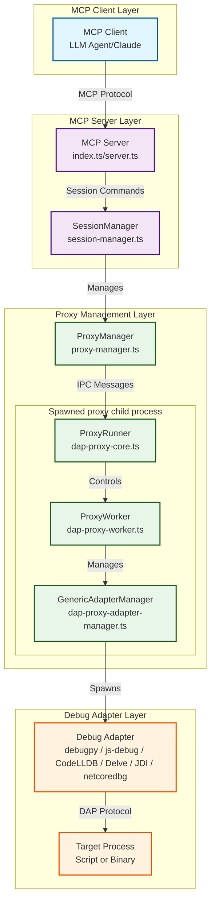
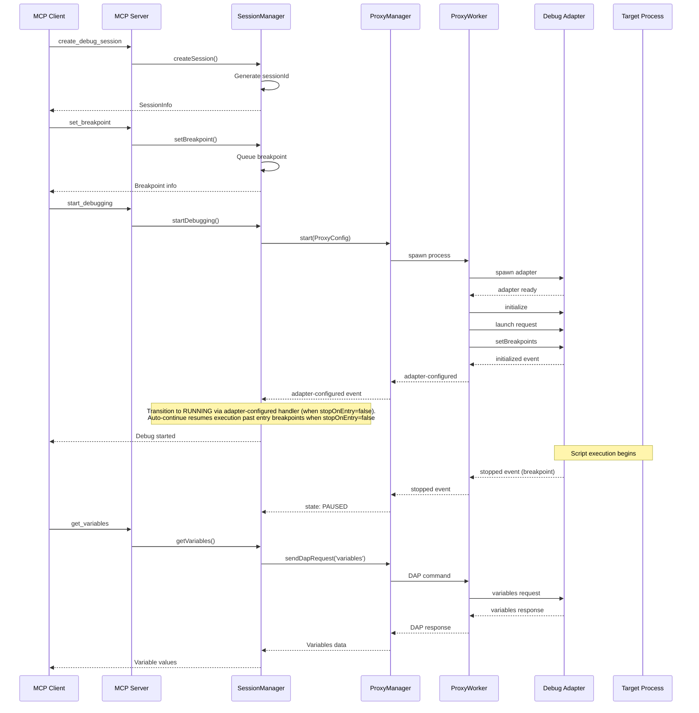

# MCP Debug Server - System Architecture Overview

The MCP Debug Server provides a Model Context Protocol (MCP) interface for interactive debugging, enabling LLM agents to debug code with step-through execution, breakpoint management, and variable inspection capabilities.

## High-Level Architecture



## Component Responsibilities

### 1. MCP Server Layer (`src/server.ts`, `src/index.ts`)
- **Purpose**: Entry point for MCP protocol communication
- **Key Files**: 
  - `src/server.ts` - Main server implementation
  - `src/index.ts` - CLI entry point with subcommands (stdio, http, sse [deprecated], check-rust-binary)
- **Responsibilities**:
  - Handle MCP tool registration and routing
  - Manage server lifecycle and transport modes
  - Route debugging commands to SessionManager

### 2. SessionManager (`src/session/session-manager.ts`, thin facade over a 4-class hierarchy: `session-manager-core.ts` → `session-manager-data.ts` → `session-manager-operations.ts` → `session-manager.ts`)
- **Purpose**: Central orchestrator for debug sessions
- **Key Dependencies**:
  ```typescript
  // From src/session/session-manager-core.ts
  export interface SessionManagerDependencies {
    fileSystem: IFileSystem;
    networkManager: INetworkManager;
    logger: ILogger;
    proxyManagerFactory: IProxyManagerFactory;
    sessionStoreFactory: ISessionStoreFactory;
    debugTargetLauncher: IDebugTargetLauncher;
    environment: IEnvironment;
    adapterRegistry: IAdapterRegistry;
  }
  ```
- **Responsibilities**:
  - Create and manage debug session lifecycle
  - Coordinate ProxyManager instances (one per session)
  - Handle breakpoint management and state synchronization
  - Provide high-level debugging operations (step, continue, evaluateExpression)

### 3. ProxyManager (`src/proxy/proxy-manager.ts`)
- **Purpose**: Manages communication with debug proxy process
- **Key Features**:
  - Spawns and controls proxy worker process
  - Implements typed event system for DAP events
  - Handles request/response correlation with timeout management
- **Event Flow**:
  ```typescript
  export interface ProxyManagerEvents {
    'stopped': (threadId: number | undefined, reason: string, data?: StoppedEvent['body']) => void;
    'continued': () => void;
    'terminated': () => void;
    'exited': () => void;
    'initialized': () => void;
    'init-received': () => void;
    'error': (error: Error) => void;
    'exit': (code: number | null, signal?: string) => void;
    'dry-run-complete': (command: string, script: string) => void;
    'adapter-configured': () => void;
    'dap-event': (event: string, body: unknown) => void;
  }
  ```

### 4. DAP Proxy Architecture (`src/proxy/dap-proxy-*.ts`)
The proxy system follows a three-layer architecture:

#### a. ProxyRunner (`src/proxy/dap-proxy-core.ts`)
- **Purpose**: Orchestration/lifecycle code that centralizes worker startup, transport setup, and process-level error handling. Despite its framing, this file performs real side effects (touches `process`, timers, stdio, IPC, and exits the process).
- **Features**:
  - Configurable communication channels (IPC/stdin)
  - Message processing pipeline
  - Global error handling setup (including `SIGTERM` and `SIGINT`)
  
#### b. ProxyWorker (`src/proxy/dap-proxy-worker.ts`)
- **Purpose**: Core worker implementing debugging logic
- **State Management**:
  ```typescript
  // From src/proxy/dap-proxy-interfaces.ts
  enum ProxyState {
    UNINITIALIZED = 'uninitialized',
    INITIALIZING = 'initializing',
    CONNECTED = 'connected',
    SHUTTING_DOWN = 'shutting_down',
    TERMINATED = 'terminated'
  }
  ```
- **Responsibilities**:
  - Handle initialization and configuration
  - Manage DAP client connection
  - Process debugging commands
  - Track request timeouts

#### c. GenericAdapterManager (`src/proxy/dap-proxy-adapter-manager.ts`)
- **Purpose**: Manages debug adapter process lifecycle
- **Features**:
  - Spawns the debug adapter with proper arguments
  - Handles process monitoring and cleanup
  - Manages stdout/stderr streams

## Data Flow Sequence



## Technology Stack

### Core Technologies
- **Runtime**: Node.js 22+ with ES modules
- **Language**: TypeScript 5.x with strict mode
- **Protocol**: Model Context Protocol (MCP) over stdio or Streamable HTTP (legacy SSE deprecated)
- **Debugging**: Debug Adapter Protocol (DAP) 1.51.0
- **Testing**: Vitest with 90%+ coverage
- **Bundling**: tsup with `noExternal` for self-contained distributions

### Key Dependencies
- `@modelcontextprotocol/sdk` - MCP server implementation
- `@vscode/debugprotocol` - DAP type definitions
- `MinimalDapClient (src/proxy/minimal-dap.ts)` - DAP client for adapter communication
- `winston` - Structured logging
- `fs-extra` - Enhanced file system operations

### Architecture Patterns
1. **Dependency Injection** - All major components use constructor injection
2. **Factory Pattern** - ProxyManagerFactory, SessionStoreFactory for testability
3. **Event-Driven** - Extensive EventEmitter usage with proper cleanup
4. **Functional Core** - Pure functions in `src/dap-core/*` for state management (note: `src/proxy/dap-proxy-core.ts` is orchestration code, not part of the pure functional core)
5. **Error Boundaries** - Centralized error handling with user-friendly messages

## Deployment Options

### 1. NPX Distribution (Recommended)
```bash
npx @debugmcp/mcp-debugger stdio        # stdio mode
npx @debugmcp/mcp-debugger http -p 3001 # Streamable HTTP mode (recommended for remote)
npx @debugmcp/mcp-debugger sse -p 3001  # SSE mode (deprecated)
```
- Self-contained bundles with all dependencies
- No installation required
- CLI bundle includes all workspace packages
- Proxy bundle includes all proxy dependencies

### 2. Local Node.js
```bash
pnpm install && npm run build
node dist/index.js stdio                # stdio mode
node dist/index.js http -p 3001         # Streamable HTTP mode (recommended)
node dist/index.js sse -p 3001          # SSE mode (deprecated)
```

### 3. Docker Container
- Dockerfile configured for stdio and HTTP modes
- Python and debugpy pre-installed in image
- Volume mounting for workspace access
- Uses bundled versions for minimal image size

### 4. Python Launcher
- `mcp-debugger-launcher` package provides easy installation
- Auto-detects Docker or falls back to local Node.js

## Bundle Architecture

The project uses a dual-bundle approach for distribution:

### CLI Bundle (`cli.mjs`)
- Built with tsup using `noExternal: [/./]`
- Includes all workspace dependencies
- ESM format for modern Node.js compatibility
- Entry point for npx distribution (the npm package exposes `./dist/cli` as the bin shim, which loads `cli.mjs`)

### Proxy Bundle (`proxy-bundle.cjs`)
- Separate bundle for the DAP proxy process
- CommonJS format for child process compatibility
- Includes all proxy dependencies (fs-extra, winston, etc.)
- Auto-detected by proxy bootstrap. The `DAP_PROXY_WORKER` environment variable is set internally by the bootstrap to signal worker-mode detection to the proxy entry point.

This architecture enables:
- Zero-dependency npx distribution
- Minimal Docker images without node_modules
- Fast startup times with pre-bundled code
- Simplified deployment across environments

## Security Considerations

1. **Process Isolation** - Each debug session gets its own proxy worker process. The target process behavior depends on mode: in launch mode, the proxy worker spawns the debug adapter which in turn launches the target; in attach mode, the target is an external process that the adapter connects to.
2. **Path Validation** - Script paths validated before execution
3. **Timeout Protection** - All operations have configurable timeouts
4. **Resource Cleanup** - Automatic cleanup of orphaned processes

## Performance Characteristics

- **Startup Time**: ~1-2s for session initialization
- **Command Latency**: <100ms for most DAP commands
- **Memory Usage**: ~50MB base + ~20MB per active session
- **Concurrent Sessions**: Limited by system resources. In Streamable HTTP mode, each MCP session gets an isolated `DebugMcpServer` instance routed by `Mcp-Session-Id`, so multiple clients run independently without serialization. In legacy SSE mode, all connections share a single `DebugMcpServer` and tool calls from a single client are serialized. STDIO mode supports a single client connection.

## Error Handling Strategy

The system uses centralized error messages (`src/utils/error-messages.ts`) with:
- User-friendly error descriptions
- Troubleshooting suggestions
- Consistent timeout messages
- Detailed logging for debugging

Example from error-messages.ts:
```typescript
proxyInitTimeout: (timeout: number) =>
  `Debug proxy initialization did not complete within ${timeout}s. ` +
  `This may indicate that the debug adapter failed to start or is not properly configured. ` +
  `Check that the required debug adapter is installed and accessible.`
```

## Next Steps

- See [Component Design](./component-design.md) for detailed component documentation
- See [Testing Architecture](./testing-architecture.md) for test patterns and coverage
- See [Development Guide](../development/setup-guide.md) for getting started
